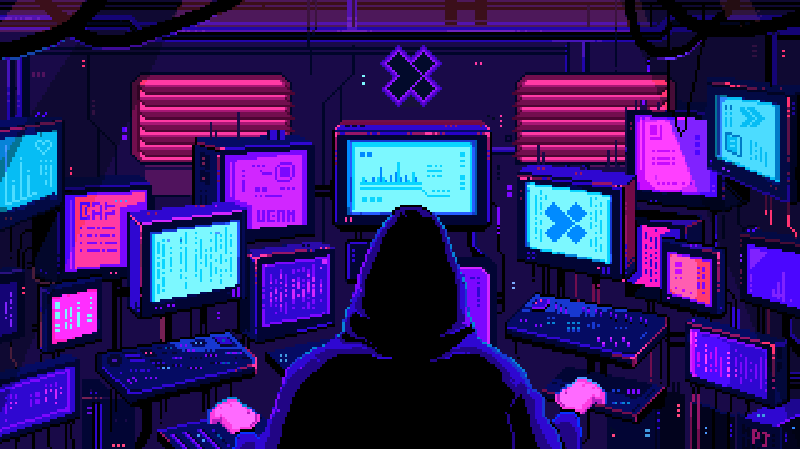

<h1 align="center">Hi there 👋, Welcome to my GitHub page!</h1>

- I'm **Haqdad Khan**, a Software Developer working in various domains like full-stack, frontend, and backend development.
-  Currently learning **MERN Stack** through the <a href="https://www.coursera.org/professional-certificates/ibm-full-stack-javascript-developer" target="_blank">IBM Full-Stack JavaScript Developer - Specialization</a>
<!-- -  Check out my repo for course material and achievements [here](https://github.com/haqdadkhan/ibm-mern-stack-dev) -->
-  Check out my repository for [AOS (Animation on Scroll)](https://github.com/haqdadkhan/aos)
-  Open to collaborating on **Frontend Projects**
-  Reach me: [Mail](mailto:haqdadkhan.dev@gmail.com)
<!-- - Explore my [Portfolio](https://haqdad.vercel.app) -->

---

##  Languages & Technologies:

  
  
  
  
  
  
  
  
  

##  Tools:

  
  
  
  
  <!--  -->

---

##  Projects:

- **<a href="https://troveo-rho.vercel.app/" target="_blank">Troveo:</a>**

  - Built with **React**, **React Router**, **Redux Toolkit (RTK)**, and **Tailwind CSS**.
  - Features a responsive **Single Page Application (SPA)** with centralized state management and modern UI components.

- **<a href="https://repowr.vercel.app/" target="_blank">Repowr:</a>**

  - Built with **React**, **React Router**, and **Tailwind CSS**.
  - Features a responsive **Single Page Application (SPA)** with clean navigation and a modern user interface.

- **<a href="https://gamilo.vercel.app/" target="_blank">Gamilo:</a>**

  - Built with **HTML**, **CSS**, **Bootstrap**, and **JavaScript**.
  - Features a responsive **multi-page online casino website** with a dedicated **user dashboard** and modern interface.

- **<a href="https://dp-market-sigma.vercel.app/" target="_blank">DP Market:</a>**

  - Built with **React** and **Tailwind CSS**.
  - Features a responsive landing page designed for a **digital products marketplace** with a clean and modern UI.

- **<a href="https://winpkr-dashboard.vercel.app/" target="_blank">Agent Dashboard:</a>**

  - Built with **React** and **Tailwind CSS**.
  - Features an analytics dashboard with **summary cards**, **charts**, **customer response insights**, and a **minimal chat interface**.

- **<a href="https://artiai.vercel.app/" target="_blank">Arti AI:</a>**

  - Built with **React** and **Tailwind CSS**.
  - Features a responsive AI landing page with a **pixel-perfect Figma-to-Code implementation**.

- **<a href="https://mellstroy.vercel.app/" target="_blank">Mellstroy:</a>**

  - Built with **React** and **Tailwind CSS**.
  - Features a responsive landing page developed from a **Figma design**, focusing on clean layouts and modern UI.

- **<a href="https://hypetracker.vercel.app/" target="_blank">Hype Tracker:</a>**

  - Built with **React** and **Tailwind CSS**.
  - Features a responsive **cryptocurrency landing page** with a modern design and **Figma-to-Code implementation**.

* **More exciting projects are coming soon...**

---

##  GitHub Stats:

  
  

---

##  Connect:

  
  

---
